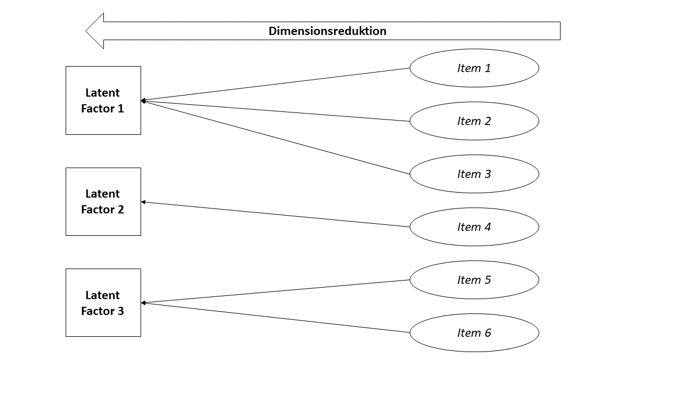

---
title: "Cluster-Analyse"
subtitle: "eine Einführung mit vier Anwendungsfällen"
author: "Dipl.-Psych. Yannik Paul"
institute: "Christian-Albrechts-University Kiel"
date: "03.12.2022"
output:
  xaringan::moon_reader:
    yolo: false
    ratio: "16:9"
    css: ["xaringan-themer.css", "my-style.css"]
    lib_dir: libs
    nature:
      titleSlideClass: ['left', 'top']
      highlightStyle: github
      highlightLines: true
      countIncrementalSlides: false


---

```{r setup, include=FALSE}
options(htmltools.dir.version = FALSE)
```
```{r xaringan-themer, include=F, warnings=F}
library(xaringanthemer)

style_mono_accent(
  base_color = "#9b0a7d",
  header_font_google = google_font("Overpass"),
  text_font_google   = google_font("Noto Sans", "300", "300i"),
  code_font_google   = google_font("Fira Mono")
)
```


```{r xaringan-logo, echo=FALSE}
xaringanExtra::use_logo(
image_url = "logo.png" ,
width = "180px",
height = "60px",
position = xaringanExtra::css_position(top="0em", right="0em"))
```


# Clusteranalyse
- K-Means Clustering
  + Beispiel Schwertlilien
- (Agglomerative) Hierarchical Clustering
  + Beispiel Big-Five Personality


---
# Faktoranalyse



---
# Faktoranalyse

- Fasst für uns **Variablen** zu **latenten Faktoren** zusammen
  + Fragebögen
  + Gruppen an Symptomen zu Symptomdimensionen
  + Transdiagnostische Faktoren?
- Aber was tun, wenn wir nicht Variablen, sondern Personen in Gruppen aufteilen wollen?
  + machen wir in der klinischen Psychologie ganz automatisch mit Diagnosen
  + aber auch andere Subgruppen können uns interessieren
- Was ist wenn wir gar nicht wissen:
  + ob es Subgruppen gibt
  + durch welche Werte auf welchen Variablen sie sich auszeichnen
  + ...

.center[
**Lösung: Cluster-Analysen sind die _umgedrehte_ Variante von Faktor-Analysen!**
]

---
# Cluster Analyse

- eigentlich eine Methode aus der Data-Science
  + manchmal auch *unsupervised machine learning*
- viele verschiedene Varianten, wir lernen heute kennen:
  + K-Means Clustering
  + Hierarchical Clustering
- Cluster-Analysen beantworten uns:
  + Wie viele Gruppen gibt es unter meinen Personen?
  + Welcher Gruppe ist jede Person zugehörig?
  + In welche Gruppe kommt eine Person, wenn ich sie neu meinen Daten hinzufüge?


---
class: inverse, center

# K-Means Cluster-Analyse

---
# K-Means Clustering

.center[
*Idee: Zentroide als __Clusterzentrum__*
]

Sei $m$ die Anzahl an Variablen und $k$ die Anzahl an Cluster:

- Schritt 1: Für einen Datensatz mit $m$ Variablen male einen $m$-dimensionalen Raum auf
- Schritt 2: Male alle Datenpunkte in diesen $m$-dimensionalen Raum
- Schritt 3: Male zufällig $k$ Zentroide in diesen Graphen
- Schritt 4: Bestimme für jeden Punkt den euklidischen Abstand zu jedem Zentroid - der Punkt gehört ab jetzt zu dem Zentroiden, wo der Abstand am kürzesten ist
- Schritt 5: Berechne für jeden so entstandenen Cluster den Zentroiden als Mittelpunkt aller Punkte des Clusters

**Wiederhole bis Konvergenz erreicht ist (SS verändert sich nicht mehr)**


---
# Visualisierung

```{r, echo=F, message=F, warning=F}
knitr::include_url("https://www.naftaliharris.com/blog/visualizing-k-means-clustering/")
```


---
# Anzahl an Clustern?

- Schön und gut, aber wie bestimme ich die Anzahl an Clustern?

**Antwort: Scree-Plot**
- Vorgehen:
  + K-Means Clustering für 1-Cluster-Lösung, 2-Cluster-Lösung, 3-Cluster-Lösung...
  + Mehrmals!
  + Goodness of fit für jede Lösung berechnen: $\textit{SS}_{\textit{within}} = \Sigma^K_{k=1} \Sigma_{x_i \in C_k} (x_i - \mu_k)^2$
  + in einem Plot darstellen

*Auch möglich: Gap-Statistic, Average Silhouette*


---
# Scree-Plot

```{r, echo=F, message=F, fig.retina=3, warning=F}
library(factoextra)
fviz_nbclust(iris[,1:4], kmeans, method="wss")

```

---
class: inverse, center
# Beispiel: Schwertlilien

---
# Datensatz

- Datensatz `iris`, Standard-R Beispieldatensatz
- drei verschiedene Arten von Schwertlilien
- angegeben jeweils:
  + Blütenblätterbreite, Blütenblätterlänge
  + Kelchblattlänge, Kelchblattbreite
- insgesamt $n=150$ Planzen erhoben


---
# Datensatz

```{r, echo=F}
knitr::kable(head(iris))
```


---
# Scree-Plot

.center[
```{r, echo=F, message=F, fig.retina=3}
library(factoextra)
fviz_nbclust(iris[,1:4], kmeans, method="wss")

```
]

---
# Ergebnisse

```{r, echo=F, message=F, warning=F}
library(tidyverse)
dat <- as_tibble(iris)


k_mean_res <- kmeans(dat[,1:4], centers=3, nstart=25)

dat$clusters <- as.factor(k_mean_res$cluster)

centroids <- as_tibble(k_mean_res$centers)
centroids$num <- 1:3
```

.center[
```{r, echo=F, fig.retina=3}
ggplot(dat, aes(x=Sepal.Length, y = Petal.Length)) + 
  geom_point(size=2.3) + theme_bw()
```
]


---
# Ergebnisse
.center[
```{r, echo=F, fig.retina=3}
ggplot(dat, aes(x=Sepal.Length, y = Petal.Length, color=clusters)) + 
  geom_point(size=2.3) + theme_bw()
```
]

---
# Ergebnisse
.center[
```{r, echo=F, fig.retina=3}
ggplot(dat, aes(x=Sepal.Length, y = Petal.Length, color=clusters, shape=Species)) + 
  geom_point(size=2.3) + theme_bw()
```
]


---
# Ergebnisse
.center[
```{r, echo=F, message=F, fig.retina=3}
ggplot(data=dat) + 
  geom_point(data=dat, aes(x=Sepal.Length, y = Petal.Length, color=clusters, shape=Species), size=2.3) + theme_bw() +
  geom_point(data=centroids, aes(y=Petal.Length, x=Sepal.Length), color="red4", size=6, alpha=.5)
```
]

---
# Ergebnisse

- Replikation der "echten" Clusterung!
- Aber natürlich besonders dann interessant, wenn wir nicht wissen ob/welche Cluster es gibt
- kann aber auch validierend sein für die Aufteilung


---
class: inverse, center

# Hierarchisches Clustering

---
# Hierarchisches Clustering

- Jeder Datenpunkt (=Jede Person) startet in ihrem eigenen Cluster
  + also haben wir am Anfang $k=n$ Cluster!
- Danach berechnen wir für jede Kombination von  Cluster deren Abstand
  + bspw. mit euklidischer Distanz $d(p,q)= |p-q|$
- Jetzt fassen wir jeweils die beiden Paare zu einem neuen Cluster zusammen, die sich am nächsten sind
  + jetzt also $\frac{n}{2}=k$ Cluster
- Wiederholen bis nur noch ein Gesamtcluster
  + Berechnung von Distanz zwischen Clustern unterschiedlich, gängig ist Ward's Method, die Varianz zwischen Clustern minimiert
- Den so entstanden Baum dann an gewünschter Stelle "abschneiden"


---
# Tree-Diagram
.center[
```{r, echo=F, warning=F, fig.retina=3}
dat <- iris

d <- dist(dat[,1:4], method="euclidian")
hc1 <- hclust(d, method="ward.D")
plot(hc1, cex=.2)

```
]
---
# Iris


.center[
```{r, echo=F, message=F, fig.retina=3}
clust <- cutree(hc1, k=3)

dat$cluster <- as.factor(as.vector(clust))

ggplot(dat, aes(x=Sepal.Length, y = Petal.Length, color=cluster, shape=Species)) + 
  geom_point(size=2.3) + theme_bw()

```
]


---
class: inverse, center
# Beispiel: Tumordaten


---
# Beispiel Tumordaten

- [Datensatz](https://www.kaggle.com/datasets/uciml/breast-cancer-wisconsin-data) von 568 verschiedenen Tumoren von Brustkrebspatient:innen
  + Klassifizierung in bösartig, gutartig
- 31 Variablen (Radius, Kompaktheit, Symmetry, Textur...)

---
# Beispiel Tumordaten

```{r, echo=F, message=F, warning=F}
library(kableExtra)
dat <- read_csv("tumor/data.csv")
knitr::kable(head(dat)) %>%  kableExtra::scroll_box(width ="100%")

```


---
# Wie viele Cluster?

.center[
```{r, echo=F, warning=F, message=F, fig.retina=3}
fviz_nbclust(dat, hcut, method="wss")

```
]
---
# Clustering

.center[
```{r, echo=F, message=F, fig.retina=3}
library(dendextend)

d <- dist(dat[,3:32], method="euclidian")
hc1 <- hclust(d, method="ward.D")

clust <- cutree(hc1, k=2)

dat$cluster <- as.factor(as.vector(clust))

dendo <- as.dendrogram(hc1)
avg_col_dend <- color_branches(dendo, k = 2)
plot(avg_col_dend, ylim=c(0,6000))

```

]

---
# Clustering

.center[
```{r, echo=F, message=F, warning=F, fig.retina=3}

d <- dist(dat[,3:32], method="euclidian")
hc1 <- hclust(d, method="ward.D")

clust <- cutree(hc1, k=2)

dat$cluster <- as.factor(as.vector(clust))


ggplot(dat, aes(x=radius_mean, y=symmetry_worst, color=cluster, shape=diagnosis)) + geom_point(size=3, alpha=.5) + 
  theme_bw() + 
  labs(x="Radius (mm)", y="Symmetry", shape="Diagnosis", color="Cluster")
```
]


---
# Clustering

.center[
```{r, echo=F, message=F, warning=F, fig.retina=3}
#https://www.kaggle.com/datasets/uciml/breast-cancer-wisconsin-data
# relevant data


fviz_cluster(list(data = dat[,3:32], cluster = clust), labelsize=0, ggtheme=theme_bw())


```
]


---
# 3-Cluster Lösung

.center[
```{r, echo=F, message=F, warning=F, fig.retina=3}

d <- dist(dat[,3:32], method="euclidian")
hc1 <- hclust(d, method="ward.D")

clust <- cutree(hc1, k=3)

dat$cluster <- as.factor(as.vector(clust))


ggplot(dat, aes(x=radius_mean, y=symmetry_worst, color=cluster, shape=diagnosis)) + geom_point(size=3, alpha=.5) + 
  theme_bw() + 
  labs(x="Radius (mm)", y="Symmetry", shape="Diagnosis", color="Cluster")
```
]

---
class: inverse, center

# Takeaway


---
# Takeaway

- Cluster-Analysen können Beobachtungen (Proband:innen) in Gruppen aufteilen die inhaltlich bedeutsam sind
- **Vorteile:**
  + Skalieren von wenig Daten auf Millionen von Datenpunkten
  + Weitesgehend verteilungsfrei und ohne Voraussetzungen
- **Nachteile:**
  + Garbage-In -  Garbage-Out
  + Bei klassischen psychologischen Variablen Tendenz zu Clustern in Hoch-Niedrig

- Es gibt noch weitere Clustering Methoden
  + Beispiel: Density-based Clustering (DBSCAN)


---
class: inverse, center

# Fragen?


---
class: inverse, center

# Danke!


---
class: inverse, center

# Bonus: Fehlgeschlagene Big-Five-Cluster-Analyse


---
# Datensatz

- (↗ Datensatz)[https://www.kaggle.com/datasets/tunguz/big-five-personality-test] von Big-Five Persönlichkeitsfragen (Open Psychometrics)
  + Version nach Goldberg et al. (1992)
- über eine Millionen ausgefüllte Fragebögen
- für dieses Beispiel resample mit $n=5000$

.center[
**Finden wir Subgruppen und wenn ja wodurch sind diese ausgezeichnet?**
]


---
# Screeplot


```{r, echo=F, message=F, fig.retina=3, warning=F}
library(factoextra)
library(cluster)

# just 1000 for faster compiling
data <- read.delim("data-final.csv/data-final.csv", nrows=1000)
data <- data[,1:50]


idx <- sample(1:length(data$EXT1), size=1000)
data <- data[idx,]
data <- data %>% mutate_all(as.numeric)
data <- na.omit(data)
fviz_nbclust(data, hcut, method="wss")


# Actually no signs of clustering in the data - (can be seen via the Gap Stat one)
#gap_stat <- clusGap(data, FUN = hcut, nstart = 25, K.max = 10, B = 50)
#fviz_gap_stat(gap_stat)

```


**Cluster-Lösung erzwingen! - 8? 16?**


---
# Clustering 


```{r, echo=F, warning=F, message=F, fig.retina=3}

d <- dist(data, method="euclidian")
hc1 <- hclust(d, method="ward.D")
plot(hc1, cex=.2)

clust <- cutree(hc1, k=16)

data$cluster <- as.vector(clust)
```


---

```{r, echo=F, warning=F, message=F, fig.retina=3}

data <- data %>% mutate(ext = rowSums(across(starts_with("EXT")))) %>%  # Extraversion
  mutate(opn = rowSums(across(starts_with("OPN")))) %>% # Openness
  mutate(agr = rowSums(across(starts_with("AGR")))) %>%  # Verträglichkeit
  mutate(csn = rowSums(across(starts_with("CSN")))) %>% # Gewissenhaftigkeit
  mutate(neu = rowSums(across(starts_with("EST")))) %>%# Neuro
select(c("ext", "opn", "agr", "csn", "neu", "cluster"))


data_summed <- data %>% group_by(cluster) %>% summarize(m_ext = mean(ext),
                                                        m_neu = mean(neu),
                                                        m_agr = mean(agr),
                                                        m_csn = mean(csn),
                                                        m_opn = mean(opn)
                                                        ) %>%
  pivot_longer(cols=c("m_ext", "m_neu", "m_agr", "m_csn", "m_opn"))


ggplot(data_summed, aes(x=name, y = value, fill=name) ) +
  geom_col() + facet_wrap(~cluster)


```

